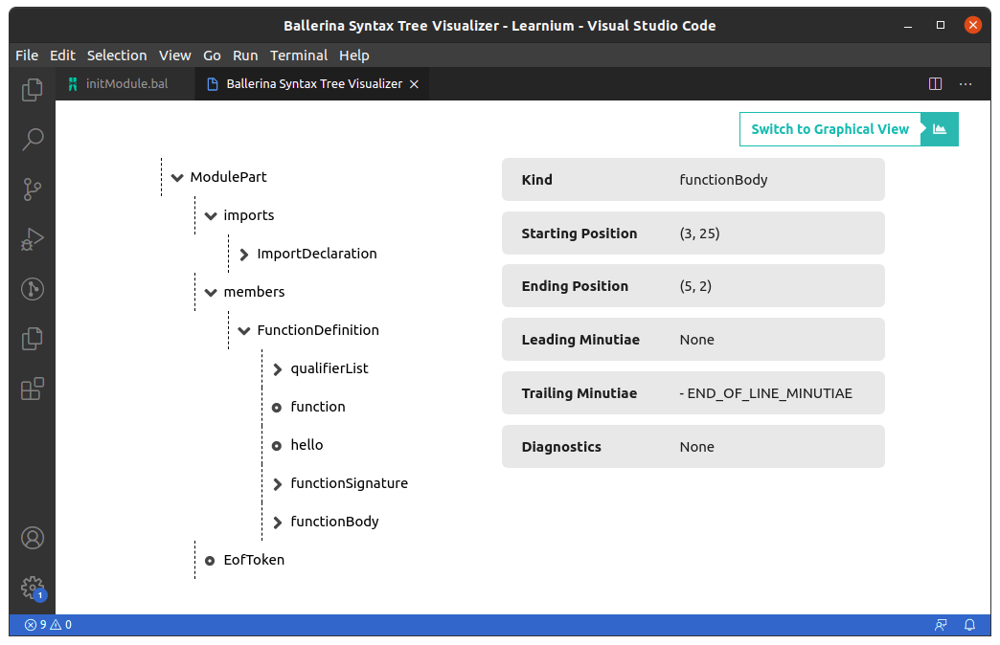
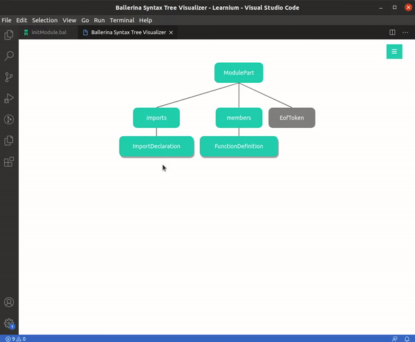
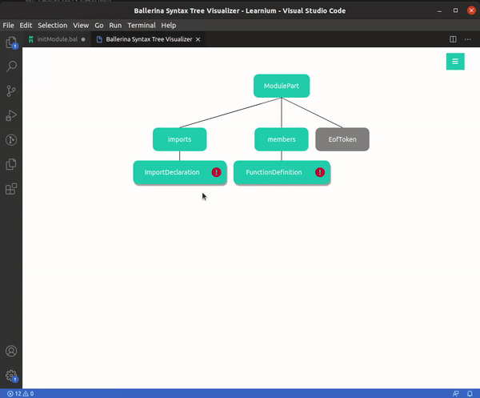
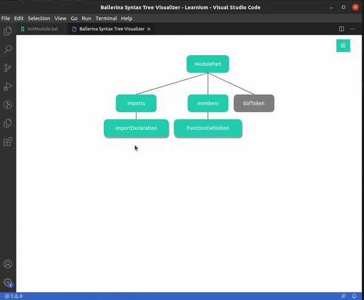
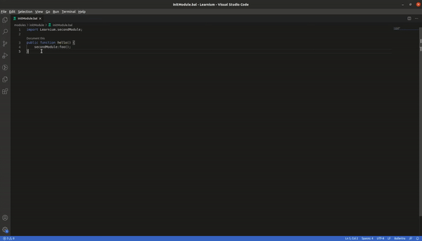

# The Ballerina Syntax Tree Visualizer

> To generate the syntax trees for any Ballerina source code

This project aims to render the syntax tree for any .bal piece of code.
Through this, developers can get an simplified representation of their code blocks for easier analysis.

## VSCode Extension

> The capabilities of the VSCode extension come in 3 main forms.
* Generate the full syntax tree of a Ballerina source file    
* Generate the subtree of the syntax tree for a particular block of code
* Locate a particular piece of code on the full syntax tree

### These tree representations can be viewed in two forms.
* The Graphical Representation
    - 
* The Dropdown Representation
    - 

### Basic Usage

The command for the full syntax tree retrieval can be found on the Command Palette.
- 

The sub syntax tree retrieval and locate code options can be found as Code Actions.
- 

### Features
> The syntax trees rendered through the visualizer have muliple features.
* Full collapsibility
* View node details
    - 
* Track syntax diagnostics
    - 
* Locate the tree node on the text editor
    - 
* Switch to full tree mode from sub syntax trees and locate trees
    -     

**All of these features are available on the Dropdown Representation as well.**
